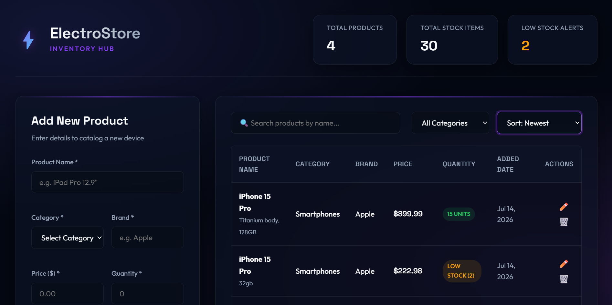

# ⚡ ElectroStore - Inventory Management System

A full-stack **Inventory Management Information System** developed for a small electronics store. The application follows a modern API-based architecture where the frontend communicates with the backend using RESTful API calls without page refreshes.

The system allows store staff to manage products, monitor inventory levels, search inventory, and perform complete CRUD (Create, Read, Update, Delete) operations through a responsive web interface.

---

## 📸 Application Preview

> Dashboard Screenshot



*(Replace `dashboard.png` with your screenshot or update the image path.)*

---

# 🚀 Features

- Dashboard displaying:
  - Total Products
  - Total Stock Items
  - Low Stock Alerts
- Create Product
- Read Products
- Update Product
- Delete Product
- Live Product Search
- Category Filtering
- Price Sorting
- Client-side Validation
- Server-side Validation
- RESTful API Architecture
- Responsive User Interface
- Automatic Low Stock Detection
- Toast Notifications
- Loading Indicators
- MongoDB Database
- In-Memory Database Fallback
- Automated Testing using Jest & Supertest

---

# 🏗️ System Architecture

```
Browser
      │
      ▼
Frontend (HTML + CSS + JavaScript)
      │
 Fetch API Requests
      │
      ▼
Node.js + Express REST API
      │
      ▼
MongoDB (Mongoose)
      │
      ▼
Fallback In-Memory Repository
```

---

# 💻 Technology Stack

## Frontend

- HTML5
- CSS3
- Vanilla JavaScript
- Fetch API

## Backend

- Node.js
- Express.js

## Database

- MongoDB
- Mongoose ODM

## Testing

- Jest
- Supertest

---

# 📂 Project Structure

```
inventory-store/
│
├── config/
│   └── db.js
│
├── controllers/
│   └── productController.js
│
├── middleware/
│   ├── errorMiddleware.js
│   └── validationMiddleware.js
│
├── models/
│   └── product.js
│
├── public/
│   ├── app.js
│   ├── index.html
│   ├── style.css
│   └── dashboard.png
│
├── routes/
│   └── productRoutes.js
│
├── tests/
│   └── product.test.js
│
├── .env.example
├── .gitignore
├── app.js
├── package.json
├── server.js
└── README.md
```

---

# ⚙️ Environment Variables

Create a `.env` file in the project root.

```env
PORT=5001

MONGODB_URI=mongodb://127.0.0.1:27017/inventory_store
```

---

# 📦 Installation

Clone the repository

```bash
git clone <repository-url>
```

Install dependencies

```bash
npm install
```

Start development server

```bash
npm run dev
```

Run production

```bash
npm start
```

Application URL

```
http://localhost:5001
```

---

# 🌐 REST API Endpoints

| Method | Endpoint | Description |
|----------|-------------------|----------------------|
| GET | /api/products | Get all products |
| GET | /api/products/:id | Get single product |
| POST | /api/products | Create product |
| PUT | /api/products/:id | Update product |
| DELETE | /api/products/:id | Delete product |

---

# ✔ CRUD Operations

### Create

Add new inventory products.

### Read

Display all available products.

### Update

Modify product details.

### Delete

Remove products from inventory.

---

# 🔍 Search, Filter & Sorting

The system supports:

- Search by Product Name
- Filter by Category
- Sort by Newest
- Sort by Price
- Automatic Dashboard Statistics

---

# ✅ Validation

### Client Side

- Required Fields
- Positive Price
- Positive Quantity
- Input Format Validation

### Server Side

- Schema Validation
- Invalid Request Handling
- JSON Error Responses

---

# 🧪 Testing

The project includes automated tests using:

- Jest
- Supertest

Run tests:

```bash
npm test
```

Tests include:

- CRUD Operations
- Validation
- API Endpoints
- Error Handling

---

# 🔮 Future Improvements

- User Authentication
- JWT Authorization
- Barcode Scanner
- Product Images
- Excel Export
- PDF Reports
- Sales Module
- Supplier Management
- Customer Management
- Dashboard Charts

---

# 👨‍💻 Author

**Muhammad Noman**

Programming for Information Systems

Dublin Business School

---

# 🤖 AI Assistance

This project was developed with AI assistance as permitted under the module assessment guidelines.

AI tools were used for:

- Project planning
- Code suggestions
- Debugging support
- Documentation improvements

All generated content was reviewed, modified, tested, and integrated by the student.

---

# 📄 License

This project is developed for educational purposes as part of the **Programming for Information Systems** module at **Dublin Business School**.
